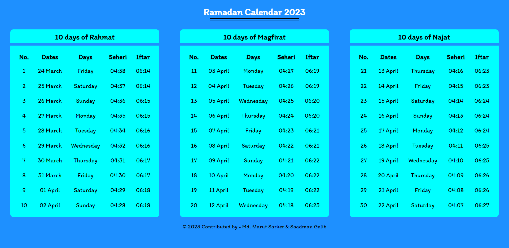

# Ramadan Calendar

This is a simple calendar for the holy month of Ramadan. It is built using Vue3 with html and css.

## Usage

- Clone the repo `git clone https://github.com/mdmarufsarker/ramadan-calendar.git`
- Run `npm install`
- Run `npm run dev`
- Open `http://localhost:3000/` in your browser

## Website Demo [Ramadan Calendar](https://ramadan-calendar.netlify.app)

